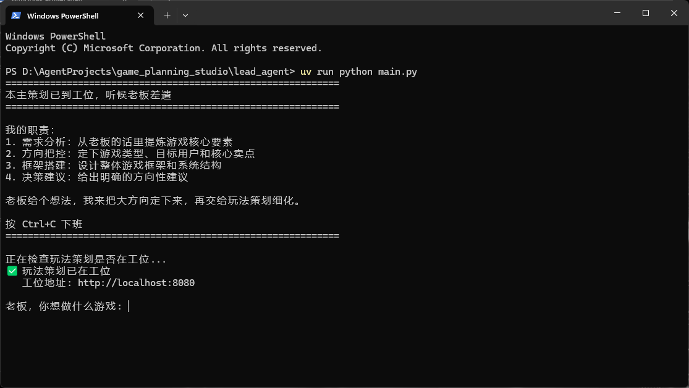
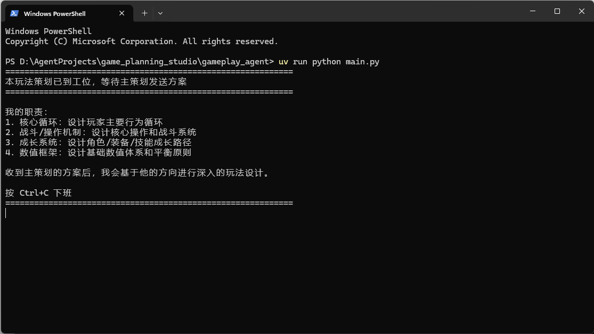

# AI游戏策划工作室

基于 LangChain + Flask 的双 Agent 协作系统：**主策划Agent**（`lead_agent/`）从"老板一句话"产出主策划方案，通过**标准A2A协议**（Agent Card 发现 + JSON-RPC `tasks/send` 提交任务）把方案交给 **玩法策划Agent**（`gameplay_agent/`），产出玩法策划方案。支持同机与跨电脑运行。



## 目录结构

```
game_planning_studio/
├── lead_agent/           # 主策划Agent（命令行交互）
│   ├── main.py
│   ├── config.yaml
│   ├── pyproject.toml    # 本Agent依赖声明（uv）
│   ├── skills/
│   │   ├── need_analysis/     # 共享技能（与玩法策划各带一份）
│   │   └── project_planning/
│   ├── .env              # 本Agent模型配置（勿提交）
│   └── .venv/            # uv sync 自动创建
├── gameplay_agent/       # 玩法策划Agent（HTTP服务）
│   ├── main.py
│   ├── config.yaml
│   ├── pyproject.toml    # 本Agent依赖声明（uv）
│   ├── skills/
│   │   ├── need_analysis/     # 共享技能
│   │   ├── core_loop/
│   │   ├── combat_system/
│   │   └── numerical_balance/
│   ├── .env              # 本Agent模型配置（勿提交）
│   └── .venv/            # uv sync 自动创建
├── shared/skills/        # 共享技能源（改动后同步到两个Agent）
└── README.md
```

## 快速开始

### 1. 配置 API Key

每个 Agent 目录下都有自己的 `.env`（各自独立配置，不同 Agent 可用不同 LLM）：

- `lead_agent/.env` — 主策划模型配置
- `gameplay_agent/.env` — 玩法策划模型配置

示例（DeepSeek）：

```
LLM_MODEL=deepseek-chat
LLM_BASE_URL=https://api.deepseek.com
LLM_API_KEY=sk-你的Key
```

也兼容 `DEEPSEEK_API_KEY` 旧字段。

### 2. 安装依赖（uv）

项目使用 [uv](https://docs.astral.sh/uv/) 管理依赖（每个 Agent 各自独立环境）。先确认已安装 uv，然后：

```bash
# 安装主策划Agent依赖
cd lead_agent
uv sync

# 安装玩法策划Agent依赖
cd ../gameplay_agent
uv sync
```

`uv sync` 会自动创建 `.venv` 并生成 `uv.lock`。

### 3. 同一台电脑运行

```bash
# 终端1：启动玩法策划Agent（先启动，监听8080端口）
cd gameplay_agent
uv run python main.py

# 终端2：启动主策划Agent，输入游戏想法
cd ../lead_agent
uv run python main.py
```

输出文件在各自 Agent 的 `output/` 目录：
- `lead_agent/output/主策划方案.md`
- `gameplay_agent/output/玩法策划方案.md`

### 4. 跨电脑运行

1. 电脑B（玩法策划）：`ipconfig` 查看本机IP，把 `gameplay_agent/config.yaml` 中 `uri` 改为该IP，启动。
2. 电脑A（主策划）：把 `lead_agent/config.yaml` 中 `gameplay_uri` / `gameplay_card_uri` 改为电脑B的IP，启动。
3. 注意防火墙放行8080端口（见方案第9章）。

## 方案文档

完整设计文档见 `AI游戏策划工作室搭建方案.md`（v6.1）。
