# AI 策划团队从 0 到 1:用 CodeBuddy 多 Agent 协作做一款肉鸽卡牌游戏

> **来源**:GameRes 游资网 | https://www.gameres.com/901202518.html
> **作者**:Morre(腾讯互娱 魔方魔镜工作室)
> **发布时间**:08-12 | 阅读量:33.3k
>
> **项目封面** ——《无尽尖塔》网页原型
>
> 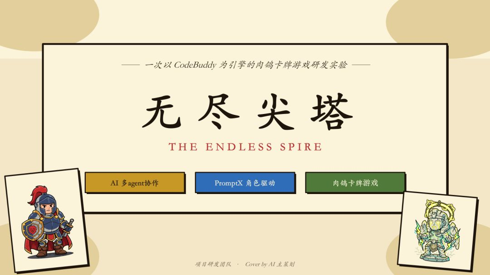

## 目录

- [引言](#引言)
- [为什么选择复刻《杀戮尖塔》](#为什么选择复刻杀戮尖塔)
- [项目目标](#项目目标)
- [最终成果展示](#最终成果展示)
- [项目流程](#项目流程)
- [多 Agent 工作流](#多-agent-工作流)
- [项目中的文档结构与数据资产](#项目中的文档结构与数据资产)
- [原型开发中的关键系统清单](#原型开发中的关键系统清单)
- [AI 在整个流程中的优势](#ai-在整个流程中的优势)
- [AI 的局限](#ai-的局限)
- [宪法层:让 AI 遵守项目规则](#宪法层让-ai-遵守项目规则)
- [我的经验总结](#我的经验总结)
- [Q&A](#qa)
- [快问快答](#快问快答)
- [核心金句摘录](#核心金句摘录)

---

## 引言

本次分享主要介绍如何利用 **CodeBuddy** 与 **PromptX** 构建一个多 Agent 游戏策划团队,并在**两天内**完成一款《杀戮尖塔》风格肉鸽卡牌游戏的原型开发。

> 这个项目不是一次严肃的商业化研发,也不是一套已经完全成熟的工业级流程。它更像一次极限条件下的实践:以 CodeBuddy 作为 Vibe Coding 工具,以 PromptX 作为多 Agent 协作插件,让 AI 扮演不同策划角色,从 0 开始完成游戏定位、核心循环、纸面策划、网页原型、Debug 和美术升级。

最终得到的结果是一款可以在网页上运行的卡牌肉鸽原型:包含**职业选择、节点地图、战斗系统、卡牌图鉴、遗物、敌人、随机事件、休息点、商店、精英怪、Boss** 等核心功能。

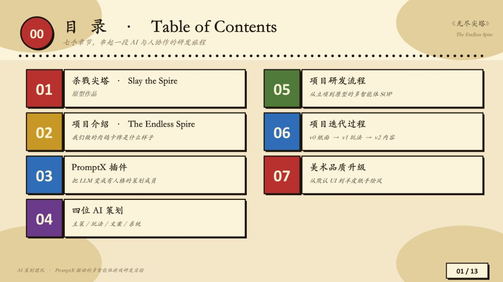
*▲ 项目 PPT 目录页*

**关键结论:**

- AI 在策划案阶段几乎拥有统治力,但到了 Debug 阶段,人依然必须参与。
- AI 可以帮你把大量繁琐流程跑起来,但最后对结果负责的人一定是做游戏的人。

---

## 为什么选择复刻《杀戮尖塔》

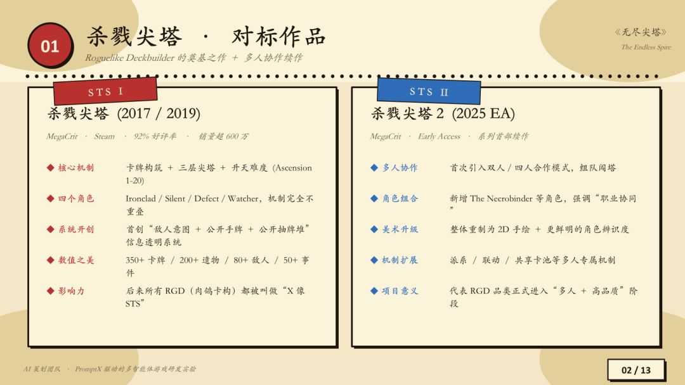
*▲ 尖塔实验——卡牌对象作品*

《杀戮尖塔》是一款桌面式卡牌肉鸽游戏,也是很多卡牌肉鸽产品的原型。其核心体验概括为:

1. 选择一个拥有不同被动能力的角色。
2. 进入一张由多个节点组成的随机地图。
3. 在地图上经历战斗、随机事件、商店、休息点、精英怪与 Boss。
4. 通过抽牌、出牌、防御、攻击、构筑牌组来推进战斗。
5. 每一局地图、事件、奖励、构筑都不同,因此带来持续变化的体验。

**选择复刻该游戏的验证目的:**

- CodeBuddy 能否完成一个复杂度适中的游戏网页原型;
- 多 Agent 策划团队能否独立产出足够完整的 GDD 和系统设计;
- AI 是否能在卡牌、遗物、敌人、随机事件、UI 与美术等环节形成连续工作流;
- 人在整个流程中到底应该扮演什么角色。

---

## 项目目标

用 CodeBuddy 和 PromptX,从 0 到 1 做出一款可以运行的《杀戮尖塔》风格肉鸽卡牌**网页原型**。

**项目限制条件:**

1. **只做一个职业**——仅保留战士职业
2. **以网页原型为主**——不接入 Steam,不做完整客户端和移动端适配
3. **优先复刻核心玩法**——节点地图、战斗、抽牌、出牌、护盾、敌人意图、随机事件、遗物、奖励、休息、商店、Boss
4. **先纸面策划,后 Vibe Coding**
5. **把 AI 能做和不能做的部分都暴露出来**

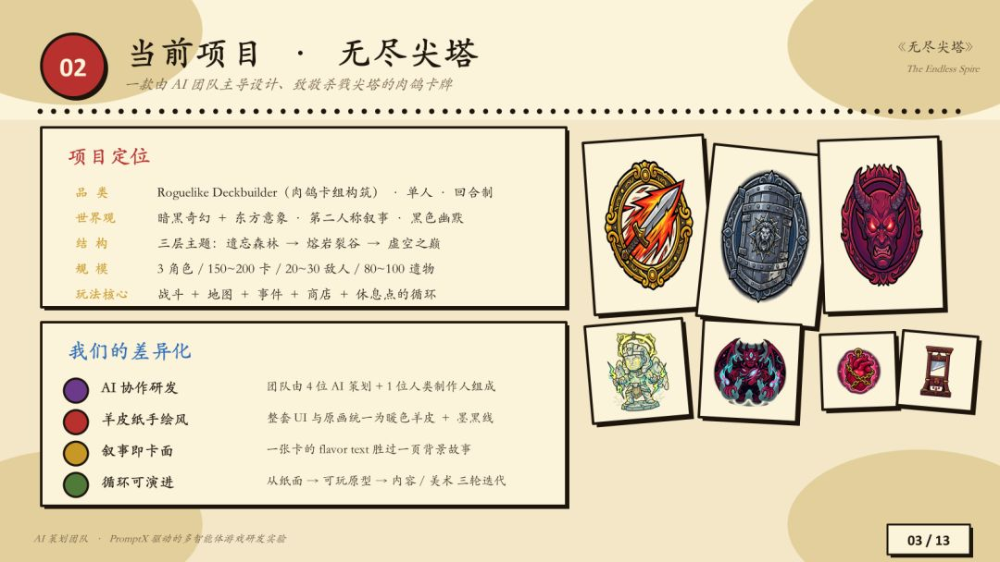
*▲ 《无尽尖塔》原型——节点地图*

---

## 最终成果展示

最终原型是一个可以网页试玩的肉鸽卡牌游戏。

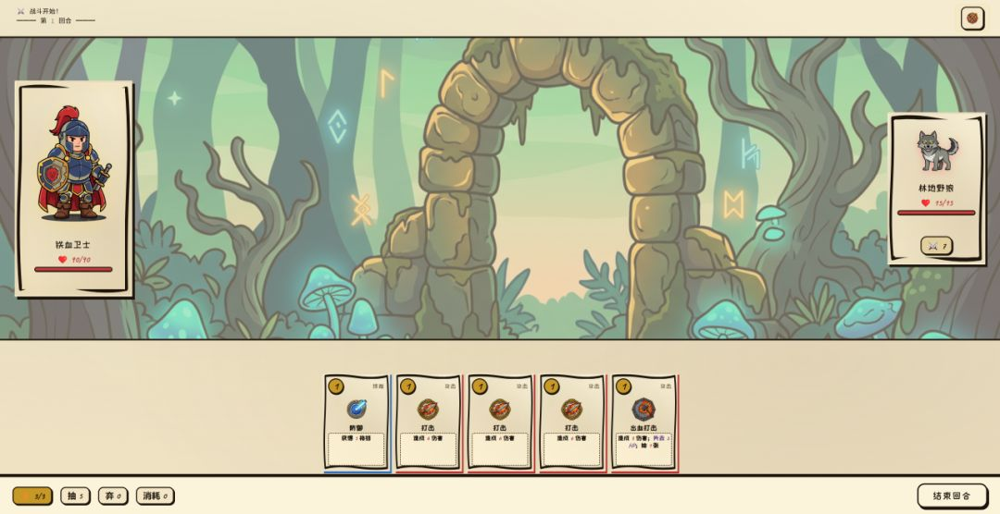
*▲ 《无尽尖塔》游戏画面(战斗场景)*

### 主界面与教程

进入游戏后,玩家会看到"开始攀登"的主界面。游戏中有一个比较好的设计:教程和世界观背景被结合在了一起。

文案策划没有单独写一份生硬的操作说明,而是把玩法规则嵌入故事背景中:

- 世界尽头有一座没有顶的塔;
- 塔有不同层数;
- 每一层包含不同节点;
- 每类节点对应不同玩法;
- 战斗环节有自己的规则。

这样既交代了游戏背景,也完成了新手教学。

### 卡牌图鉴

游戏内有卡牌图鉴,结构类似《杀戮尖塔》。卡牌用于对敌人造成伤害、防御、触发构筑效果,升级后会产生数值或效果变化。

例如:

- **打击**:造成基础伤害;
- **打击+**:升级后造成更高伤害;
- **防御类卡牌**:提供护盾;
- **能力卡**:使用后应从牌库中移除,进入能力区,避免反复洗回牌库。

卡牌系统不是只做展示,而是进入了战斗逻辑。

### 遗物与道具

- 战斗胜利后获得金币加成;
- 战斗结束后回复生命;
- 精英遗物和 Boss 遗物比普通遗物更强。

> ⚠️ **注意**:遗物文案和创意描述是 AI 比较容易翻车的地方——如果只给笼统要求,它会写出与图像、设定风马牛不相及的内容。

### 敌人与地图节点

- **敌人分类**:普通怪、精英怪、Boss 怪。
- **地图节点**:起点、普通战斗、随机事件、精英怪、商店、休息点、Boss。

### 战斗界面

战斗采用简化的卡牌对撞形式("炉石式"交互):

1. 每回合从牌组中抽取若干张牌。
2. 玩家消耗能量打出攻击牌或防御牌。
3. 攻击牌可以指定敌人造成伤害。
4. 防御牌可以为角色叠加护盾。
5. 回合结束后敌人行动,角色可能受到伤害。
6. 游戏记录攻击、掉血、护盾、弃牌、消耗牌等行为。

原型没有复杂动画,也没有精细打击反馈,但战斗闭环是完整的。

### 随机事件与重新开局

随机事件会从事件池中抽取,**抽过的事件不会重复**。玩家可能遇到类似这样的选择:

- 损失生命,获得一张特殊卡;
- 随机升级一张卡;
- 损失金币,获得奖励;
- 从几张普通卡中选择一张加入牌组。

**肉鸽体验保留:**

- 构筑不满意,可以回到菜单重新开始;
- 有事暂离,可以继续上一局;
- 每次重新开始,地图都会刷新。

---

## 项目流程

整个流程可以概括为六个阶段:

1. 招聘 AI 策划团队
2. AI 自主讨论
3. 纸面策划
4. Vibe Coding
5. Debug
6. 美术升级

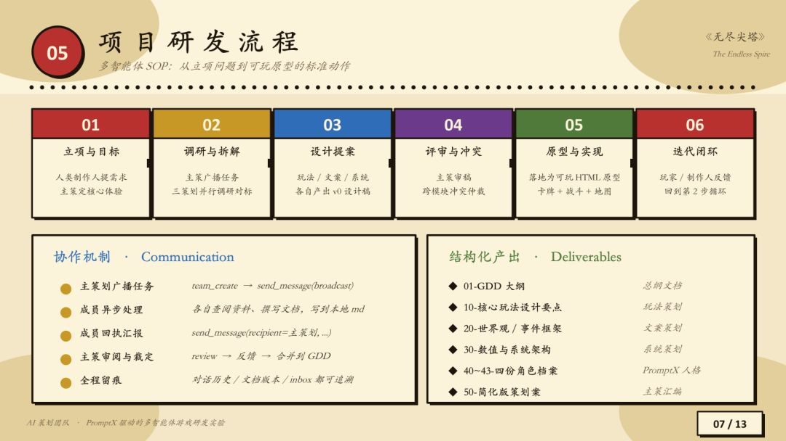
*▲ 项目研发流程 6 步总览*

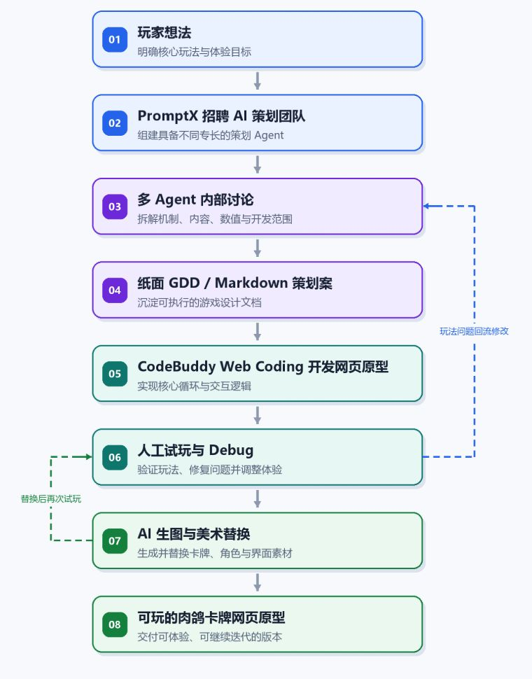
*▲ AI 多 Agent 协作流程总览(另一种视角)*

---

## 多 Agent 工作流

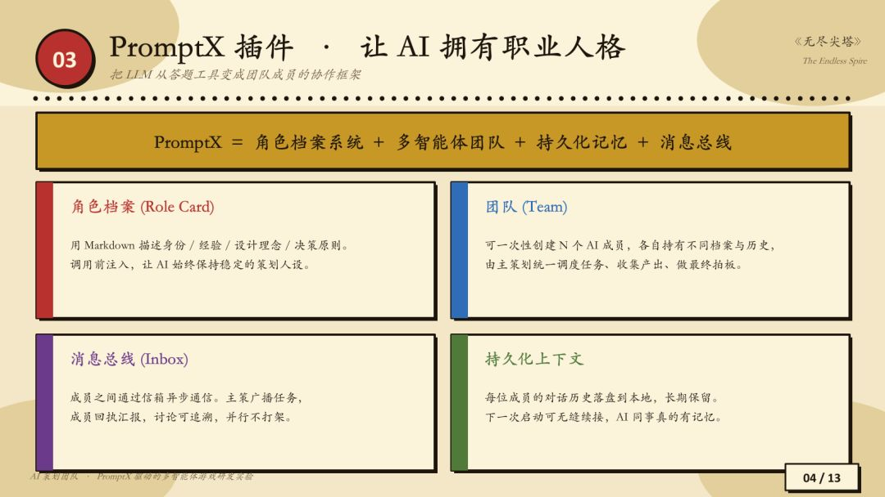
*▲ PromptX 插件——让 AI 拥有职业人格*

### Step.1 招聘 AI 策划团队

项目中的关键插件是 **PromptX**。

PromptX 可以理解为一个"HR"或"人才市场":它可以根据需求生成不同身份的 Agent,并为每个 Agent 建立角色档案、职责边界。

在原生编程软件中,通常并不存在真正可调度的多 Agent 系统。模型可以模拟多个角色,但本质上仍然像"一个人在人格分裂"。PromptX 的价值就在于让每个 Agent 拥有独立的"职业人格"。

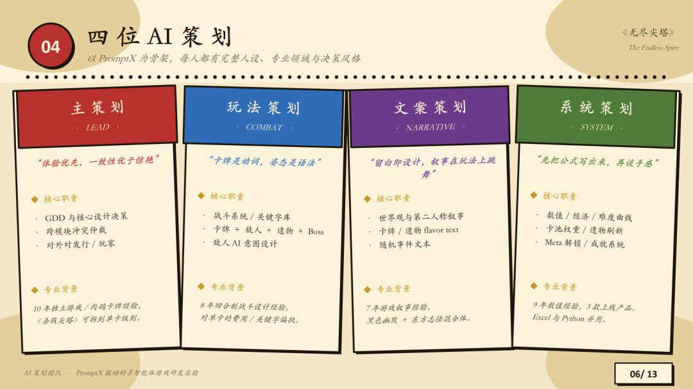
*▲ PromptX 插件的核心能力*

**PromptX 在这个项目里主要承担四件事:**

1. **生成角色档案**——类似"简历",包括姓名、职位、项目职责、专业领域、熟悉品类、设计理念、决策原则等。
2. **组建团队**——从"人才市场"中挑出符合项目要求的成员,让他们以团队方式协作。
3. **持久化记忆**——每次讨论产生的成果,会被拆分写入对应 Agent 的记忆或档案中。下一次启动时,这些角色不需要重新解释项目背景。
4. **长期复盘和历史总线**——角色可以保留此前讨论的核心结论,持续参与后续决策。

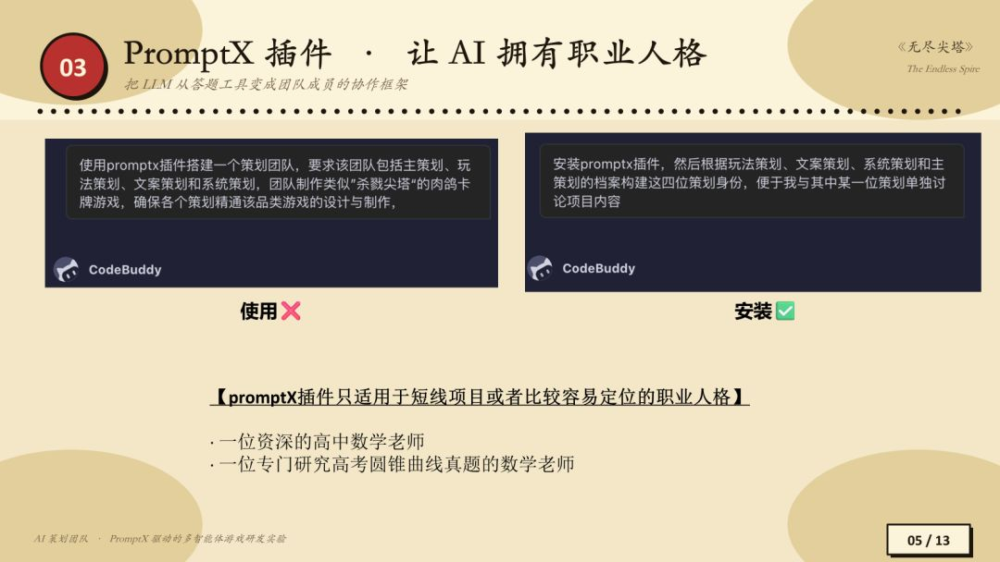
*▲ 主策划 / 玩法策划 / 系统策划 / 文案策划 角色档案*

**最终保留的四个策划角色:**

| 角色 | 主要职责 |
|------|----------|
| 主策划 | 统筹项目方向、组织讨论、收束决策 |
| 玩法策划 | 设计核心循环、卡牌机制、构筑与战斗规则 |
| 系统策划 | 负责系统拆解、流程规则、界面与功能结构 |
| 文案策划 | 负责世界观、教程、卡牌与遗物描述 |

在这个项目中,没有让 AI 自动生成一整套完整策划团队,而是基于个人判断只保留这四个角色。原因很简单:商业化策划在这个项目里不需要;数值策划 AI 做不好;原型的规模也不需要过多岗位。

> 💡 **实践经验:明确要求"安装 PromptX 插件"**
> 使用 PromptX 时,不要只说"使用 PromptX"。一定要明确要求:**安装 PromptX 插件**。
> 实践中的常见误区:部分 Web Coding 工具不会真的安装插件,只会告诉你"已经用了",实际上仍然在自己跑。结果就是效率很低,角色档案、记忆和讨论记录都没真正生效。

### Step.2 AI 自主讨论


*▲ AI 团队自动拆出的 12 个工作流程*

团队建立后,AI 策划团队收到的核心指令:

> 召集策划团队进行讨论,产出一版 CodeBuddy 可以实现的、界面简化版《杀戮尖塔》策划案,保留战士一个职业即可。

就这一句话,AI 团队自动拆出了 **12 个工作流程**。每完成一个阶段,AI 会主动向人类确认:这一部分是否 OK,是否需要删减,是否可以继续进入下一步。

> ⚠️ AI 可以讨论,但最终拍板仍然在人。

在实际流程中,不需要看每个 Agent 自言自语的所有中间过程。通常只看最后输出的表格、文档或结论。只有当 Debug 出现严重问题时,才会回头看它的中间过程。

### Step.3 纸面策划

项目第一阶段只做纸面设计,不直接进入 HTML 原型。原因是:如果策划案还没定,就开始做网页,后面会出现**两层修改压力**:

1. 策划规则要改;
2. HTML 和前端逻辑也要跟着改。

这会让 AI 很容易陷入混乱,甚至一直改不出来。

因此先要求 AI 团队把规则、卡牌、遗物、敌人、节点、随机事件等内容都写进 Markdown 文档中。纸面内容确认后,再进入网页开发。

### Step.4 Vibe Coding

纸面策划确认后,CodeBuddy 开始把规则实现成网页原型。

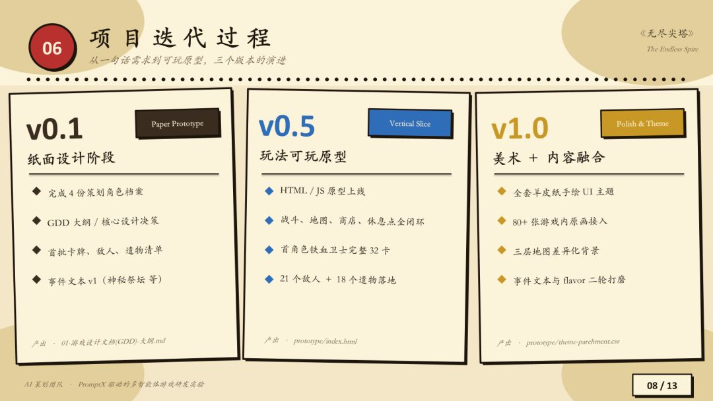
*▲ 项目迭代过程:从 v0.1 到 v1.0*

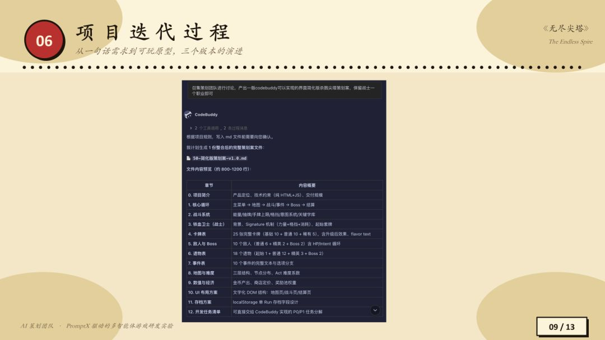
*▲ 项目迭代过程:代码 + 节点地图*

**这个阶段包括:**

- **基础体验**:主菜单、教程页面、角色选择、随机地图、战斗界面、卡牌交互
- **卡牌机制**:抽牌、弃牌、消耗牌
- **收集与流程**:卡牌图鉴、遗物图鉴、敌人图鉴、存档与继续游戏、重新开局

对于这种网页原型,AI 的效率非常高。它可以把一个大体量系统拆成多个模块,并持续往 Markdown 和代码里写入实现。

> ⚠️ 但从这个阶段开始,**人的参与也明显增加**。因为只要进入可玩原型,就一定会出现大量真实体验问题:UI 是否挤、节点是否重叠、战斗规则是否符合预期、卡牌是否有视觉遮挡等。

### Step.5 Debug

**Debug 是整个项目中最耗时间、最耗 Token、也最需要人类参与的阶段。** 纸面策划和美术各用了半天,真正可玩的玩法原型 Debug 用了一整天。整个流程中最费 Token 的也不是策划案,而是 Bug 修复和反复验证。

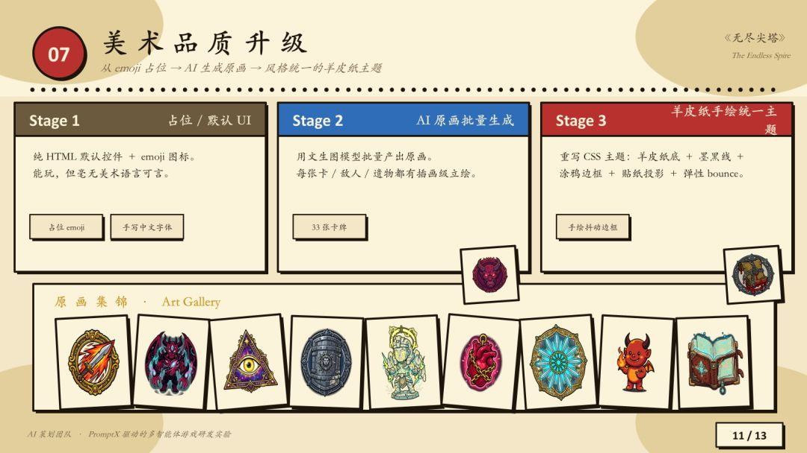
*▲ 美术品质升级的三阶段规划*

#### 案例一:地图节点怎么都改不对

第一版地图已经有《杀戮尖塔》的基本形态,但存在几个问题:

- UI 挤在屏幕中间;
- 节点图标太小;
- 节点之间距离太近;
- 连接线不明显;
- 横屏空间没有利用好。

**最初给 AI 的指令:**

> 地图图标比较小,节点之间的连接线消失,需要增大节点图标,用深色虚线。

AI 跑完代码后汇报已经完成,但实际几乎没改。

**之后继续调整指令:**

> 连接线效果已经实现了,但观感上仍然存在问题。每一层地图修改为浅色,让深色连接线更加显眼;节点尺寸还是太小,能够扩大三倍;调整为横屏界面;连接线不要采用直线,需要采用曲线。

结果 AI 又改出一版更乱的:节点全部乱放,大小没变,还发生重叠。

深入排查后发现,问题不在于 AI 完全不能改,而是它听不懂"三倍""更分散""更好看"这类人类表达。真正有效的表达应该是它能直接操作的参数。

**最终有效的指令:**

> 把普通图标大小缩小为 70px。确保路线经过每个图标的中心,不能出现路线偏移。图标中心必须对齐连接线。

这时 AI 才真正改对。

> 💡 **实践经验:用 AI 能听懂的语言**
> "放大三倍""更分散一点""更好看一点"对人类有意义,但对 AI 不一定可执行。在 Vibe Coding 场景里,更有效的是:
> - 改成多少 px;
> - 从哪个坐标到哪个坐标;
> - 哪个元素中心对齐;
> - 哪个 CSS 属性调整;
> - 哪个状态下移除哪个对象。

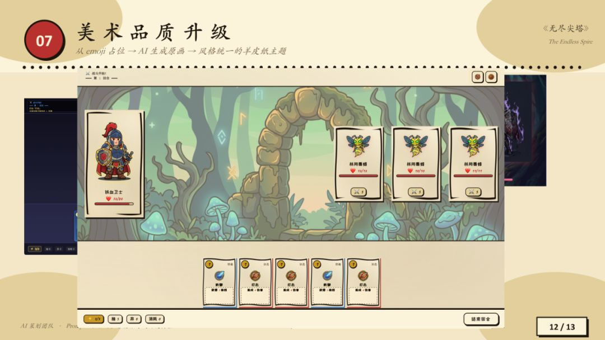
*▲ Debug 中美术升级效果反馈*

#### 案例二:护盾不会消失

另一个典型 Bug 是护盾逻辑。

在类似《杀戮尖塔》的规则中,玩家使用防御牌后会获得护盾,护盾一般应在回合结束或下一轮规则中按设定清除。但原型中出现过一个问题:护盾不仅延续到下一回合,甚至完成一局后还继承到下一局。

从代码运行角度看,AI 可能认为没问题:卡牌能被选中、能打出、能产生护盾、游戏没有报错。但从游戏规则角度看,这是严重 Bug。

> ⚠️ AI 很难自动发现"规则层面的问题"。如果人没有明确写出"护盾应该在什么时候清除",AI 就只会判断程序是否运行,而不会判断游戏是否真的对。

#### 案例三:能力卡应该移除

项目中还出现过能力卡的规则问题。能力卡在使用一次之后应从牌库中移除,不能多次使用。

AI 随后会以玩法策划身份解释:能力卡应进入能力区,避免反复洗回牌库,再去修改代码。

这类问题说明:AI 能理解规则,但前提是**人必须把规则明确指出来**。

### Step.6 美术升级(原文编号为 Step.2)

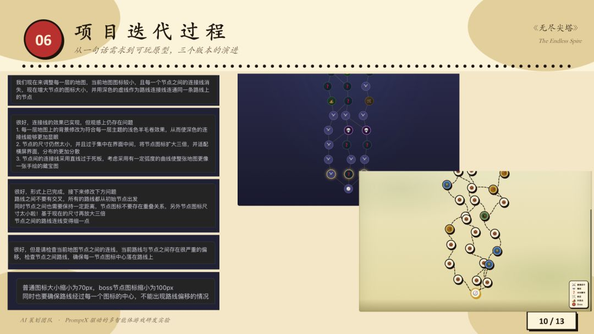
*▲ 项目迭代过程(代码 + 地图节点对比)*

第一版原型大量使用 emoji 占位:战士可能是一个盾牌、怪物可能是一个蘑菇、卡牌图标也是语义相关的 emoji。

初版原型大量使用 emoji 占位显得过于草率、太像 AI 产物,于是直接问 CodeBuddy:

> 现在我觉得这个界面有点丑,请问有没有什么办法可以把游戏变得更加生动,或者让它的画面更加丰富?

CodeBuddy 建议使用**内置生图功能**,为角色、怪物、卡牌和界面生成图标与原画。

第一版美术升级希望接近《杀戮尖塔》的欧美暗黑风格,但生成结果过于写实,像买量广告里的"不能玩的游戏"。之后又要求整体画面简化,继续调整 UI 布局、卡牌选中状态、角色站位、边框和羊皮纸风格。

**最终成品约有 70% 满意:**

- 比 emoji 版本更像游戏;
- 有统一的羊皮纸、手绘风格;
- 卡牌、角色、敌人都有图像;
- 卡牌有一定震动、碰撞和攻击反馈;
- UI 有边框和整体主题。

但需要承认的是:目前的效果还有提升空间,图标细节和画面精细度仍有优化余地,CodeBuddy 内置生图能力在现阶段能满足原型开发需求,后续版本还会持续迭代。如果想进一步升级,可以自己用更强的图像工具生成素材,再导入 CodeBuddy,甚至导入多帧图片做动画。

---

## 项目中的文档结构与数据资产

这个项目虽然是一个两天完成的网页原型,但它并不是"只靠一句话生成游戏"。真正支撑它持续迭代的,是一组 Markdown 文档。这些文档承担了类似小型项目资料库的作用:

| 文档类型 | 作用 |
|----------|------|
| GDD / 设计文档 | 项目宪法层,记录最高规则、核心玩法和确认流程 |
| 核心决策文档 | 记录已拍板的系统、玩法、职业和 UI 决策 |
| 团队协作文档 | 记录各策划角色的职责边界 |
| 卡牌数据文档 | 存放基础卡、升级卡、稀有卡、能力卡等设计 |
| 敌人与事件文档 | 记录普通怪、精英怪、Boss、随机事件和奖励逻辑 |
| Debug 记录 | 记录每次发现的问题、修改指令和 AI 的处理结果 |

这类文档有两个好处。

**第一**,它让 AI 的工作不再只停留在单轮对话里。每次修改都能落到文件中,后续 Agent 可以继续读取、讨论和补充。

**第二**,它让人类可以随时回到项目的"事实层"。当 AI 开始乱讲、偷懒或者忘记规则时,人可以要求它重新读取 GDD、核心决策和相关 Markdown 文档,让它回到正确轨道上。

> 💡 **实践经验:原型越复杂,越要让 AI 写文档**
> 对一个游戏原型来说,Markdown 不是附属品,而是多 Agent 协作的地基。如果没有稳定文档,AI 很容易在长对话里丢失规则、越权修改,最后整个项目进入混乱。

---

## 原型开发中的关键系统清单

从结果看,这个原型已经覆盖了一款卡牌肉鸽游戏的主要骨架。虽然每个系统都比较简化,但组合起来已经能构成一局完整体验。

```
主菜单
  ├─ 教程 / 世界观
  ├─ 卡牌图鉴
  ├─ 遗物图鉴
  ├─ 敌人图鉴
  └─ 开始攀登
       ├─ 职业选择:战士
       ├─ 起始事件
       ├─ 随机地图
       │    ├─ 普通战斗
       │    ├─ 随机事件
       │    ├─ 精英怪
       │    ├─ 商店
       │    ├─ 休息点
       │    └─ Boss
       └─ 战斗系统
            ├─ 抽牌
            ├─ 出牌
            ├─ 能量
            ├─ 护盾
            ├─ 弃牌池
            ├─ 消耗牌
            ├─ 敌人意图
            └─ 战斗奖励
```

这份清单也解释了为什么 Debug 会变成最重的环节。只要这些系统彼此发生联动,Bug 就不再是单点问题,而会变成跨系统问题:卡牌效果影响战斗、战斗结果影响地图奖励、奖励又影响牌组构筑……任何一环出错,都会牵动整条链路。

AI 可以帮你把这些系统搭起来,但它不一定能判断这些系统组合后是否真的好玩。这个判断依然要回到人类试玩。

---

## AI 在整个流程中的优势

### 1. 策划案阶段效率极高

在策划案书写阶段,AI 几乎拥有"绝对的统治力"。原因是:

- 它能快速理解《杀戮尖塔》《怪物列车》等品类资料;
- 能快速整理核心循环、系统拆解和页面结构;
- 能根据不同 Agent 职责分工产出文档;
- 能把卡牌、遗物、敌人、事件等内容整理成表格;
- 能持续记录讨论过程和修改原因。

一个人手动查资料、整理竞品、分门别类写文档,可能要一周甚至两周。交给 AI 策划团队,很多内容十分钟就能出第一版。

### 2. 多 Agent 可以减少职责混乱

没有 PromptX 时,让一个模型同时扮演多个策划,很容易出现"所有角色都来改同一件事"的情况。例如你说"玩法策划去改这个机制",结果文案策划、系统策划、主策划也都在自己的文档里加一句"要修改这个机制"。这会导致职责边界混乱。

**PromptX 的价值是:**

- 每个 Agent 有独立档案;
- 职责写入角色文档;
- 对话时可以只激活某个角色;
- 圆桌讨论时可以规定发言顺序;
- 修改某个角色内容时,不会牵动所有角色。

甚至可以要求:

> 主策划先发言,说明今天讨论目标。
> 玩法策划基于目标输出观点。
> 文案策划补充世界观和文本意见。
> 系统策划检查系统结构。
> 最后由主策划收束结论。
> 三轮讨论后输出最终文档。

如果只追求效率,也可以不看中间讨论,只看最终文档。

### 3. 美术批量产出很快

美术升级是 AI 明显提效的环节。如果逐一用 AI 生图模型等工具生成 80 张图再逐张导入游戏,会非常耗时。而直接让 Vibe Coding 工具在项目中批量生成并替换素材,半天就可以完成全部美术升级。

这不代表结果一定优秀,但在原型阶段非常有价值。

### 4. 把人的精力释放到更重要的地方

AI 最大的作用不是让人彻底不干活,而是把人从繁琐流程中解放出来。过去需要大量时间完成的资料收集、文档整理、表格汇总、初版代码生成、素材占位,现在都可以交给 AI。这样人可以把更多精力放在:

- 创意是否成立;
- 玩法是否好玩;
- 构筑是否有趣;
- 数值是否合理;
- UI 是否舒服;
- Debug 是否彻底;
- 玩家体验是否顺畅。

---

## AI 的局限

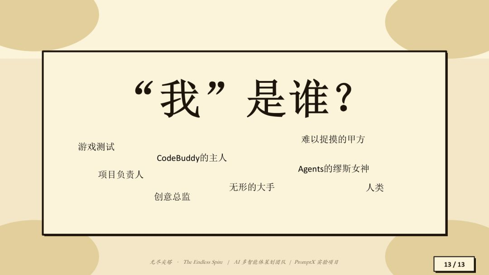
*▲ 作者角色介绍:CodeBuddy 负责人 / 腾讯互娱魔镜 / Agent 与产品进化*

### 1. Debug 阶段必须有人验收

AI 可以说"我已经检查过了,没有 bug",但人不能因此就不看。在游戏开发中,有些问题不是代码报错,而是体验或规则不对:

- 卡牌被遮挡;
- 护盾没有清除;
- 地图节点重叠;
- 连接线偏移;
- 随机事件太少;
- 能力卡反复回到牌库;
- UI 在手机端糊成一团。

这些问题 AI 不一定会主动发现。只要程序能跑,它就可能认为没问题。

> ⚠️ **关键判断**:如果 CodeBuddy 不接入外界引擎进行真实操作,游戏测试环节——一遍一遍跑游戏、提出修改的环节——仍然需要有人负责。

### 2. 数值策划做得很差

这个项目的数值平衡基本没做。

AI 确实会做一些看起来像数值策划的事情:给卡牌设定伤害、模拟一组牌能否打过敌人、跑几次简单构筑测试、判断某组伤害是否足够。但问题是:

- 它测试次数太少;
- 不能覆盖随机抽牌的边界情况;
- 不能完整模拟人的策略流;
- 很难判断构筑长期成长是否合理;
- 最终不会对数值结果负责。

**一个务实的建议是:**

> 如果真想做一款类似肉鸽游戏,先自己写构筑。甚至可以先抄一套成熟构筑,把构筑文档喂给 AI,让它负责系统、玩法规则、界面和美术。**不要让它从零开始写数值和构筑,写出来真的非常不堪入目。**

### 3. 创意不能完全交给 AI

AI 可以作为资料搜集者、受众模拟者、意见反馈者,但很难成为真正的创意提出人。它提出的创意通常来自:网上已有资料、大量数据分析、过往训练经验、用户喂给它的内容。

一个新的点子,尤其是一个真正有意思的游戏创意,仍然需要从人的脑子里出来。

**人在这个项目中的身份可以总结为四类:**

1. CodeBuddy 的主人;
2. 游戏测试;
3. 创意总监;
4. Agent 的"缪斯女神"。

AI 可以执行、整理、扩写、生成,但方向、审美、创意、拍板和验收仍然在人。

### 4. PromptX 更适合短线项目

PromptX 很适合这类两天内完成的轻量原型项目,但不适合直接生成高度专业化、商业级的复杂职业人格。例如,PromptX 可以生成一个"数学老师",但如果你需要的是"专门研究高考圆锥曲线真题的数学老师",就必须长期喂它教材、题目、错题和解题经验。

同理,一个商业项目级的 AI 策划,也需要长期投喂项目经验、品类知识、团队规范和真实案例,而不是一键生成就能达到真人水平。

---

## 宪法层:让 AI 遵守项目规则

在项目实践中,"宪法层"是一个非常重要的概念。在项目中,每个程序或项目都可以有自己的最高规则文档。这个项目的宪法就是 GDD。所有产出都必须以宪法为最高指令。

**宪法层可以写入类似规则:**

- 每次写入 Markdown 文件前,必须向用户确认。
- 每次讨论必须至少经过三轮。
- 每次讨论必须由主策划参与。
- 最终结果必须由用户拍板后才能写入。
- 如果连续三轮无法解决问题,清除当前问题相关上下文,重新开始生成。

一个很有意思的检测方法:可以在宪法层写入一个固定称呼,例如要求 AI 每次执行任务时必须称呼你为"你的昵称"。如果某次输出突然没有称呼,就说明它有较大概率没有正确读取规则。

> 💡 **实践经验:用宪法层判断 AI 是否还在轨道上**
> 如果 AI 忘记执行宪法层里的固定规则,说明它可能没有真正按照项目要求工作。这时可以回退、重开、要求重新读取 GDD,避免它继续在错误轨道上越走越远。

---

## 我的经验总结

### 1. 不要把 AI 当成代码输入框

在 Vibe Coding 场景里,提示词不是传统意义上的"咒语"。一个实用的建议是:**不懂就问,把 AI 当成一个可以沟通的人。**

例如做美术升级时,作者直接问:

> 如果想要对当前界面进行美术品质升级,将其中的角色、怪物和场景变得更加形象,我需要进行什么操作和提供什么素材?

AI 会先了解项目内容,再列出需要替换的元素,例如玩家头像、敌人形象、卡牌图标等,并给出低成本替换、完整替换、动态方案等几种路径。你不需要一开始就写得非常"提示词工程"。先问它,让它给方案,再从方案中选择即可。

### 2. AI 不听话时,先看它中间怎么理解

平时可以只看最终结果,但如果 AI 反复改不对,就要看它中间到底在说什么、计划什么、理解了什么。很多时候不是它不能做,而是它把你的话理解成了另一件事。

这时要学会使用它能听懂的语言:

- 少说"更好看""三倍";
- 少骂它笨;
- 多说具体元素、px、坐标、中心点、状态、规则;
- 多检查它的理解链路。

### 3. AI 适合做原型,不适合让你完全撒手

这个项目可以在两天内完成,说明 AI 对游戏原型制作的提效非常明显。但这个原型也暴露出很多问题:

- 数值粗糙;
- 构筑不稳定;
- 没做移动端适配;
- 美术只能达到 70% 满意;
- Debug 依赖人类大量试玩;
- 创意和审美仍然需要人拍板。

它适合快速验证想法、做可玩的 demo、训练游戏设计理解,但不能把"可运行"直接等同于"可发布""好玩"或"商业可用"。

### 4. 焦虑可以减轻,但不能停止学习

现在很多人会因为"AI 蒸馏""AI 替代"产生焦虑。做完这个项目后会发现,焦虑反而可以减轻。原因是,真实使用之后会发现:AI 没有那么万能。它能提效,但仍然替代不了真正有经验的人,尤其替代不了长期积累出来的创意、判断、数值经验和体验感受。

但这不代表可以忽视 AI。更合理的态度是:

> 用 AI 做出适合自己的游戏,也用 AI 看清自己未来应该把能力放在哪里。

在游戏行业全面进入 AI 的阶段,人需要把更多精力放到更难被替代的部分:创意、审美、体验判断、系统理解、Debug、玩家感受和最终责任。

---

## Q&A

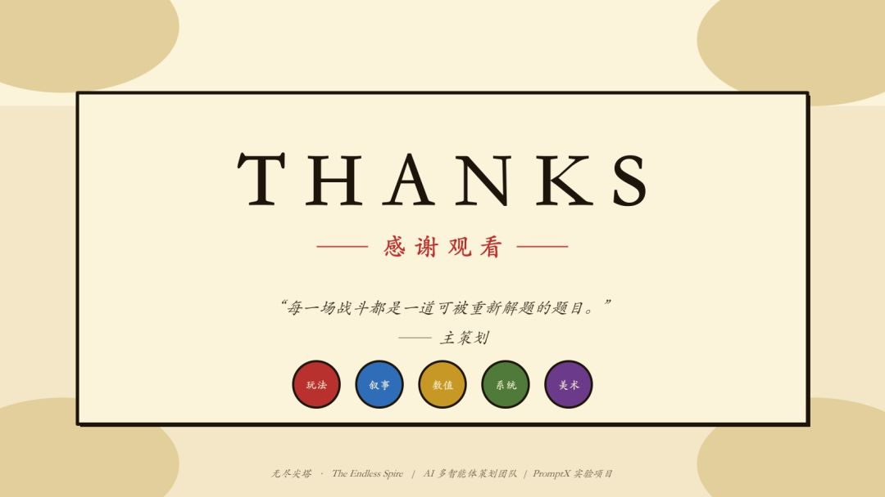
*▲ 感谢观看——Q&A 环节开始*

### Q1 有没有哪些功能 AI 反复做不对,最后必须人来接管?

**Morreding**:我觉得可以用主策划写的一句话来回答:它说"每一场战斗都是一道可以被重新解题的题目"。我认为不是这样的。AI 做的事情,确实像是一遍一遍解题。我们给它下的每一道指令,对它来说都像一道高考题,或者一道大题,它会拆解、分析、回答。但问题是:如果你提得非常笼统,它就完全解答不对;如果你提得非常仔细,它又不会完全发散。

我一开始改了很多遍的内容,是项目里的背景故事。图鉴里每个遗物都有背景故事,比如"死人的金子",听起来很厉害,但一开始它写得非常粗糙,跟图片一点关系都没有。我让它给每个遗物加介绍,如果描述得非常笼统,它就会随便找一个看起来有关的介绍,直接抛上来,完全不检验。

最后我的做法是,**把遗物外表和文案描述从外部生成好,再导入项目里,让它只负责生图和写效果**。这一块我觉得多 Agent 完不成。

但更多的 Bug 不是人手动接管的 Bug,而是你要一直跟 AI 打斗的 Bug。比如图标放大、缩小、分散一点,这些事 AI 明明可以做,但改得不一定对。**解决办法就是两个:**

1. 用它能听懂的语言;
2. 在宪法层写明规则。

宪法层非常好用。你可以问它"我们整个项目的宪法在哪里"。我这个项目的宪法就是 GDD,所有产出都必须以宪法为最高指令。比如你可以写:每次讨论必须经过几轮;每次讨论必须有主策划参与;每次讨论最后结果必须由我拍板,才能写入。这些内容写进宪法层,才能同步到整个运转体系。

如果一个问题三轮还解决不了,也可以在宪法层写:清除之前所有这一部分的谈话记忆,重新开始生成。这样它可能可以从零开始,重新帮你解决问题。

### Q2 不同模型在游戏策划里差异大吗?

**Morreding**:我整个项目使用的模型主要是 **Claude 4.7**。现在 4.8 已经出来了,但我应用下来的感受是 4.8 不如 4.7 稳定,可能会有点过度修正。除了 Claude 4.7 之外,我也会用 **GPT**。当时是 GPT-5.5,现在是 GPT-5.6。总之,一个模型跑不出来的时候,换一个问一下,可能是更好的解法。

> AI 会偷懒,你跟它聊的时间越长,它可能越看不懂你想表达什么。这时候换一个模型可能会更好。

我很早之前也用过 Auto 自动模型,它里面哪个模型有空、哪个便宜,就自动推荐哪个,产出会非常差,效率非常低。如果有可能,我还是建议大家尽量用 Claude 或 GPT 来做。实在不行,DeepSeek 也可以。目前我觉得 Claude 和 GPT 在游戏策划环节相对靠谱。**Token 消耗整体可控,最耗 Token 的环节是 Debug。** 策划案和美术生成其实都不怎么耗 Token。最耗 Token 的是你给它放开的浏览工具和自动执行。

### Q3 哪些功能没有 AI 帮忙,一个人绝对做不出来?

**Morreding**:首先很明显是**美术产图**。半天时间实现全部美术升级,你让我自己做,哪怕给我一个美术 AI,让我一张一张画,80 张图可能我半个月都画不完。我直接把这套流程交给 Vibe Coding 工具,让它在游戏里一键生成,大概半个小时到一个小时,80 张图就全部生成了,而且主题比较统一,放在游戏里直接能跑。

其次是**前期纸面探索**。AI 策划对这些游戏品类真的很了解,比如《杀戮尖塔》是什么游戏,《怪物列车》是什么肉鸽游戏,你问它,它能直接回答。文案策划对游戏世界观、叙事节奏、卡牌描述也很熟悉,问什么答什么。

> "提效"这件事情,没有 AI 是绝对完不成的。
> 人类当然也能查资料、整理、汇总、分给每个策划写文档。给我一周甚至两周,我也能做到。但交给 AI 策划,可能 10 分钟就能完成。
> AI 能帮人的最大功能,是让你把更多精力集中在更重要的事情上,比如创意、游戏测试、Debug、心流体验、游戏到底好不好玩、到底哪里需要改。

### Q4 这个项目有没有接入 Godot、Unity 这类引擎?

**Morreding**:有尝试。CodeBuddy 接入 Unity 或 UE 后,可以直接用 Vibe Coding 告诉它"在场景哪个位置生成什么内容"。之前实录版本内未发布内容时,需要找策划朋友扮演角色,AI 接入后可以生成虚拟账号,让 AI 一个人扮演所有角色。

> CodeBuddy 里有内置 Godot 插件,可以直接搜索 Godot。

### Q5 AI 做数值平衡靠谱吗?

**Morreding**:目前的数值平衡基本没做。AI 做的内容基本没有用。它不会从一开始就搭建整体数值体系。

> ⚠️ 如果是数值平衡,建议大家自己手操,不要用 AI 来做。

**AI 模拟测试的问题:**

1. 牌的出现是随机的,理想情况基本不可能稳定出现;
2. 它考虑不到大量边界情况;
3. 测试数量太少;
4. 它不能完整模拟人的策略流;
5. 它绝对不会对结果负责。

### Q6 提示词会不会很难?

**Morreding**:提示词就是对话内容。核心建议:**不懂就问它,把它当成一个完全智能的人。**

> Vibe Coding 本质上就是氛围编程,你只需要跟它对话。它不是 AI 生图那种提示词操作,本质上是你和机器人之间的对话。

### Q7 多个 Agent 之间会不会冲突?

**Morreding**:四个 AI 内部沟通比跟我沟通效率高很多。没有明显边界冲突,因为所有决策已写进核心文档。

- 用 PromptX 对话时,当前对话哪个策划就只会有那个策划回答;
- 可以拉圆桌,按顺序发言;
- 如果追求效率,直接说"三轮,给我三轮讨论,讨论完产出最终文档"。

> 如果没有 PromptX,一个模型模拟几个策划,其实是一个人在人格分裂。PromptX 会把每个 Agent 变成可以执行的脚本,把边界写得更清楚。

### Q8 PromptX 是 CodeBuddy 官方插件吗?怎么安装?

**Morreding**:好像不是官方插件。在 CodeBuddy 里安装很简单,直接让它安装。PromptX 不是 CodeBuddy 专有的,可以在其他 Vibe Coding 工具里看看。

### Q9 美术和音乐有没有成熟的 AI 工作流?

**Morreding**:

- **美术**:正规大宣发用 AI 较少。非正规工作流(活动封面、第三方平台图片)AI 接入非常多。用 AI 生图 + 板绘二次加工。
- **视频**:虚拟主播口播素材可以用 AI 视频生成,像抽卡一样抽到满意的就用。
- **音乐**:目前使用最少。重要 PV、场景音乐、角色 OST 用 AI 做的劣质感,玩家很难接受。但音效(流水声、动物叫声)完全可以用 AI。

---

## 快问快答

- **最喜欢哪个 AI 同事?**:玩法策划,因为他干的活最多。
- **用一句话形容和 AI 协作做游戏的体验**:省心,但是效果差。有点像富二代创业。
- **最想要 CodeBuddy 增加的功能**:优化 Markdown 的阅读体验,像 Word 或 Excel 一样。
- **AI 什么时候能完全独立做出一款能上架的游戏?**:不考虑商业化内容,现在就可以。但什么时候能做出一款爆款、新颖、有创意的游戏,还有非常长的路要走。
- **推荐的游戏**:《洛克王国》,后续周五更新会上架一个肉鸽模式。

---

## 核心金句摘录

> - "AI 在策划案阶段几乎拥有统治力,但到了 Debug 阶段,人依然必须参与。"
> - "AI 可以帮你把大量繁琐流程跑起来,但最后对结果负责的人一定是做游戏的人。"
> - "AI 可以讨论,但最终拍板仍然在人。"
> - "把 AI 当成一个人,一个完全智能的人。你需要做什么就跟它讲。"
> - "用 AI 做适合自己的游戏,也用 AI 看清自己未来应该把能力放在哪里。"
> - "省心,但是效果差。有点像富二代创业。"
