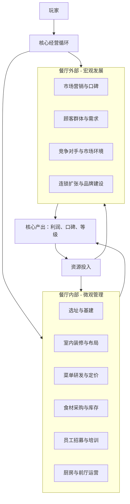

# 需求分析结果

## 核心要素提取
- **游戏类型**：[明确] 模拟经营游戏
- **目标平台**：[待确认] PC/移动端/主机均可，建议优先PC或移动端
- **核心玩法**：[明确] 餐厅经营管理，包含选址、装修、菜单设计、员工管理、客户服务等要素
- **目标用户**：[明确] 喜欢模拟经营、休闲养成、创意设计的玩家群体
- **差异化卖点**：[待确认] 需要根据具体设计方向确定

---

# 项目规划方案

## 游戏概述
一款让玩家沉浸式体验从零开始经营餐厅的模拟游戏，核心乐趣在于创造独特的餐厅、管理日常运营，并见证自己的商业帝国逐步成长。

## 核心定位
- **类型**：模拟经营 + 轻度策略 + 创意设计
- **平台**：PC（Steam/Epic）或 移动端（iOS/Android），考虑到模拟经营游戏对操作和屏幕空间的需求，**建议优先PC平台**，后续可移植移动端。
- **用户**：
  - 核心用户：25-35岁，喜欢《模拟人生》、《双点医院》、《星露谷物语》等游戏的玩家，追求放松、创造和成长的体验。
  - 泛用户：对美食、装修、商业经营感兴趣的休闲玩家。

## 系统框架
游戏将围绕 **“餐厅”** 这一核心实体，构建一个由内到外、由微观到宏观的循环体系。

**主要系统模块：**
1.  **基建与装修系统**：自由摆放桌椅、厨房设备、装饰物，影响客流容量、员工效率和顾客满意度。
2.  **菜单与研发系统**：组合食材研发新菜，平衡成本、售价、烹饪时间和顾客偏好。可引入“秘方”或“特色菜”作为成长目标。
3.  **员工管理系统**：招募厨师、服务员、清洁工等，各有属性（速度、厨艺、亲和力）和技能树。需要排班、培训、管理情绪。
4.  **顾客与口碑系统**：顾客有不同属性（耐心、口味偏好、消费力），会生成评价。好评提升口碑吸引更多顾客，差评反之。
5.  **供应链系统**：从市场采购食材，价格波动，需管理库存避免腐败。可与特定农场/供应商建立长期合作。
6.  **成长与扩张系统**：用利润升级设备、扩大店面、开设分店，最终建立餐饮品牌。

## 差异化设计
- **创新点**：
  1.  **“美食社交媒体”系统**：顾客就餐后会拍照并在游戏内“美食圈”分享，玩家的餐厅装修、招牌菜摆盘将直接影响传播效果，形成病毒式营销或公关危机。这为传统的“口碑”数值赋予了可视化的、动态的传播玩法。
  2.  **动态事件与叙事**：引入轻度RPG元素。例如，常客会有自己的故事线（如筹备求婚、庆祝升职），满足其特殊需求会获得丰厚回报或专属客源。竞争对手也可能发起“厨艺挑战”或“挖角”事件。

- **记忆点**：
  - **“今日招牌菜”动画**：每天营业前，玩家需选定一道“招牌菜”。当有顾客点选这道菜时，会触发一个简短而精美的烹饪/上菜特写动画，强化经营成就感。
  - **餐厅的“灵魂”**：允许玩家为餐厅定义一个“主题灵魂”（如“家的味道”、“复古科技”、“治愈猫咪”），该主题将影响可解锁的特殊装饰、员工服装、甚至顾客类型，让每家餐厅都极具个人色彩。

## 开发建议
- **预估周期**：
  - **MVP（最小可行产品）阶段**（包含核心循环：装修、简单菜单、顾客生成、基础收支）：4-6个月。
  - **完整版**（加入所有核心系统、差异化设计、丰富内容）：12-18个月。
  - 建议采用**分阶段EA（抢先体验）** 开发模式，早期上线核心玩法，根据社区反馈迭代添加系统。

- **关键风险**：
  1.  **玩法深度与重复性**：模拟经营游戏中后期容易陷入重复操作。必须通过“动态事件”、“长期目标”（如米其林评级、全球开店）和“差异化设计”来持续提供新鲜感。
  2.  **数值平衡**：菜品的成本、售价、烹饪时间、顾客满意度之间的平衡非常复杂，需要大量测试，否则容易导致经济系统崩溃或玩法单一化。
  3.  **内容消耗速度**：装修物品、菜谱、事件等内容消耗很快。需要强大的编辑工具或考虑支持玩家创作内容（工坊）。

**建议下一步**：围绕“美食社交媒体”和“动态叙事”这两个创新点进行更细致的玩法设计，并确定一个清晰的美术风格（如3D低多边形、2D手绘等），以指导原型开发。